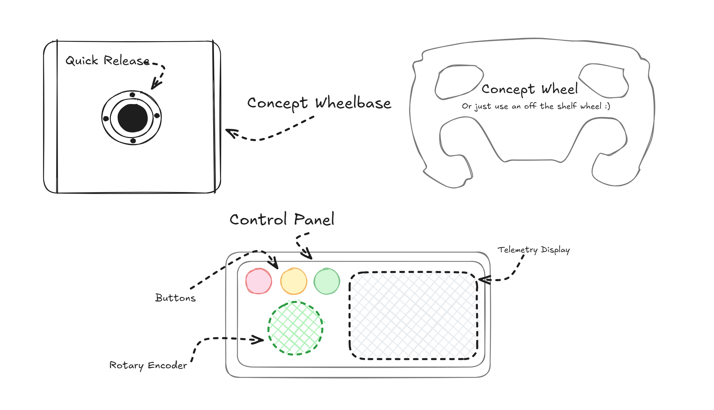
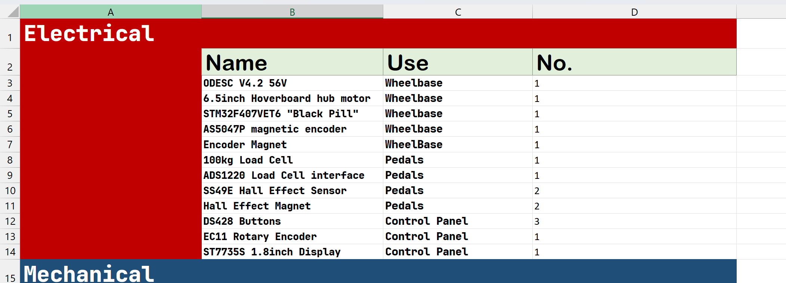

# July 19: Planning the project and researching components

Today was all about planning. I spent most of my time researching DIY direct-drive racing wheel projects and comparing different hardware options.

The biggest challenge was finding parts that were both compatible and affordable. I compared ODESC, MKS XDrive, and VESC controllers, looked at different magnetic encoders, and searched for a suitable power supply. I also evaluated whether a used commercial wheel would provide better value before deciding to continue planning the DIY route.

After several hours of searching through AliExpress and community projects, I settled on the current parts list:

- Hoverboard hub motor
- ODESC V4.2 56V (or MKS XDrive Mini)
- STM32F407VET6
- AS5047P magnetic encoder
- DIY aluminum and wood frame
- DIY pedals with a load-cell brake
- Custom telemetry dashboard

The next step is to source the hoverboard locally and begin designing the mechanical assembly.

**Total time spent: 3 hours**

# July 19: Planning the project electrical components

Today I finished choosing the compnents and finishing the electrical side of the BOM.xlsx

I have used locally available, low cost parts to complete my project, next is finsihing the mechanical STLs and BOM.

After several hours choosing parts I setteled on these:
- ODESC V4.2 56V
- 6.5inch Hoverboard hub motor
- STM32F407VET6 "Black Pill"
- AS5047P magnetic encoder
- Encoder Magnet
- 100kg Load Cell
- ADS1220 Load Cell interface
- SS49E Hall Effect Sensor
- Hall Effect Magnet
- DS428 Buttons
- EC11 Rotary Encoder
- ST7735S 1.8inch Display

The next step is to source the hoverboard locally and begin designing the mechanical assembly.

**Total time spent: 1.5 hours**

